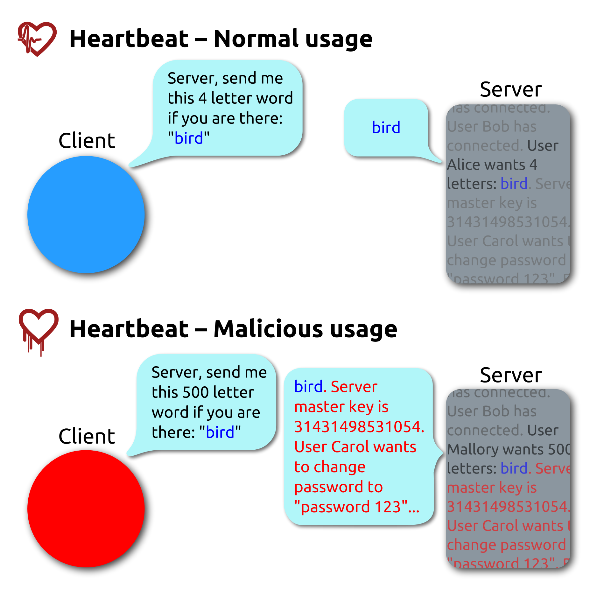

# h2_Goat

## Security Misconfiguration
### Overview of the study
- This category represents the fifth most common security vulnerability according to the OWASP Top 10 critical security of 2021.
- 90% of the applications were tested. From this test, 4.51% crash rate and more than 280 K CWE was found for this category.
- Among the security vulnerabilities identified by the CWE, the CWE-16 and CWE-611 categories are the most present. CWE-16 represents weaknesses introduced during the configuration of the software. CWE-611 represents weaknesses in software that processes XML documents that may contain XML entities with URIs that refer to documents outside of the control environment, which may result in corrupted output.

### Description
An application falls into this category if it meets any of the following conditions : 
- misconfiguration of permissions on cloud services and no security hardening of all protocol layers.
- activation or installation of features that are useless or will never be used. 
- temporary or default accounts are still active and have the original password.
- the user has access to a surplus of information contained in error messages and error handling.
- the latest security features are not enabled or not configured for updated systems.
- security settings and functionality of frameworks, libraries, databases, etc., are not implemented.
- Security headers or directives does send by the server.
- the software used is not up to date.

### How to Prevent
- Configure the development, quality assurance and production environments in the same way, so that there is a single hardening process applicable to all environments.
- Install only what you need to use, do not install anything superfluous.
- Set up a task in charge of reviewing and updating the configuration in accordance with all the security measures (notes, patch, fix and update). Also review cloud storage permissions.
- Use a segmented application architecture.
- Ensure security directives (security headers) are sent to clients.
- Automate the process of monitoring the operation and effectiveness of configurations and settings of environments.

### Example Attack Scenarios
#### Scenario 1
An application server is delivered with test applications. These applications have not been removed from the production server, this represents a security breach. If one of these applications is the administrator console and still has the default account, this represents an opportunity for the attacker to log in with this account using the default password and compromise the server. 
#### Scenario 2
The directory list is still active on the server. This provides an opportunity for a hacker to find it and download the java classes, which he will then decompile and reverse engineer. He will then be able to view the code and find access holes in the application.
#### Scenario 3
The server configuration allows very detailed errors to be returned to users. This potentially exposes sensitive information to the attacker.
#### Scenario 4
A cloud provider has default sharing permissions open to other cloud providers across the internet. This allows access to sensitive data stored in the cloud.

## Vulnerable and Outdated Components

### Overview of the study
- This category represents the sixth most common security vulnerability according to the OWASP Top 10 critical security of 2021.
- Catégorie qui est compliqué à tester et à évaluer le risque de cette vulnerabiliter. 
- Cette catégorie ne possède pas de Common Vulnerability and Exposures (CVE) associé aux CWEs inclu.
- Les CWEs qui sont associer à cette catégorie sont CWE-1104 et les deux CWEs du Top 10 de 2013 et 2017
- CWE-1104 représente les faiblesses lié à l'utilisation de composants tiers non maintenus.

### Description

You are exposed to vulnerabilities if you meet any of the following conditions: 
- You do not know the version of your components and nested dependencies.
- If you have an operating system, web/application server, database system or application that is outdated or no longer supported by the developer, you are vulnerable.
- Do not research information about old or new vulnerabilities.
- Do not upgrade the underlying platform, frameworks and dependencies.
- If compatibility between updated, upgraded or patched libraries is not tested by the developers.
- If no components security is done.

### How to Prevent

Afin d'éviter aux mieux les vulnérabilité, un processus de gestion des correctifs doit être mis en place pour : 
- Supprimer tout ce qui superflux et inutile (dépendances, fichiers, composants, fonctionnalités, documentations, etc.).
- Faire un inventaire des versions de vos composants aussi bien du côté client comme du côté server, ainsi que de leurs dépendances. Des outils comme OWASP Dependency Check, retire.js, etc. vous permette de faire votre inventaire. De plus, surveiller constament les nouvelles vulnérabilité dans les composant, à l'aide de site internet comme Common Vulnerability and Exposures (CVE) et National Vulnerability Database (NVD). 
- Aquirez vos composant seulement chez des fournisseurs officiel.
- Tenez vous informers sur les bibliothèques et les composant qui ne sont plus supporter ou qui ne publie plus de correctif. 

### Exemples Attack Scenarios

Components run with the same level of privileges as the application that uses them. This implies that a vulnerability on any of these components can have serious consequences.

- The CVE-2017-5638 vulnerability allows remote code execution of the Struts 2 framework, which allows the execution of arbitrary code on the server.
- Vulnerabilities are very present on IoTs and are generally difficult or impossible to patch.
- The Shodan IoT search engine is one of the tools that help attackers find vulnerable systems. It can help the attacker to find systems with the Heartbleed vulnerability patched in April 2014. The Heartbleed vulnerability is a weakness that allows the theft of information protected by the SSL/TLS encryption used for internet security. 

"The Heartbleed bug allows anyone on the Internet to read the memory of the systems protected by the vulnerable versions of the OpenSSL software." (source : heartbleed.com)

## Injection

### Overview of the study
- This category represents the sixth most common security vulnerability according to the OWASP Top 10 critical security of 2021.
- 94% of the applications were tested. Ce teste a révélé un taux maximal de 19% d'incident, pour une moyen de 3% d'incident et plus de 274k d'occurence CWE.
- Parmis les 274k CWE occurences, la CWE-79, la CWE-89 et la CWE-73 sont les catégories les plus présente. 
- CWE-79 : Cross-site scripting, est un type de faille de sécurité des site internet qui pemet l'injection de contenu dans une page internet. Cela proque ainsi des actions sur les navigateur web visitant la page.
- CWE-89 : injection SQL, est un type de faille de sécurité qui permet à l'attaquant de rentrer des commandes sql, dans le but de volé, modifier ou détruire des données.
- CWE-73 : External Control of File Name or Path, est un type de faille de sécurtite de logiciel qui permet à un utilisateur d'entrer et de contôler ou influencer les chemins ou les noms de fichiers dans les opérations du système de fichiers.

### Description
- Data entered by users is not validated, checked or filtered by the application. 
- Dynamic and unparmet queries are directly interpreted by the interpreter.
- Malicious data is used in the search parameters of the ORM, in order to steal data.
- The SQL command contains the malicious structure.

The most common injections are :
- SQL
- NoSQL
- OS command
- ORM (Object Relational Mapping)
- EL (Expression Language)
- OGNL (Object Graph Navigation Library)

To avoid having an application vulnerable to injections, you need to scan your code for possible weaknesses that make your application vulnerable to injection. This task can be automated by using static, dynamic and interactive security tools directly in the CI/CD pipeline to identify weaknesses and fix them before deployment. 

### How to Prevent
- use a secure API instead of an interpreter.
- providing a tightly parameterised interface or using an ORM. However, even well parameterised, this does not entirely avoid injections. 
- For all dynamic commands, use the special **"escape"** syntax which allows you to transform each user input into text, in order to avoid sending a query. However, for SQL structures it is not possible to use the **"escape"** syntax.
- Use tools such as SQL controls and LIMIT to avoid massive data leakage in case of injection.

### Exemple Attack Scenarios
#### Scenario 1
The application uses unsafe data in its SQL call. 

    $ String query = "SELECT \* FROM accounts WHERE custID='" + request.getParameter("id") + "'";
    
#### Scenario 2

The use of frameworks does not guarantee the 0 risk of having non-vulnerable requests.

    $  Query HQLQuery = session.createQuery("FROM accounts WHERE custID='" + request.getParameter("id") + "'");
    
In these two scenarios we can see that the attacker can easily modify the id parameter, which can lead in the worst case to data corruption or deletion.

## Sources

[A03 Injection](https://owasp.org/Top10/A03_2021-Injection/)

[A05 Security Misconfiguration](https://owasp.org/Top10/A05_2021-Security_Misconfiguration/)

[A06 Vulnerable and Outdated Components](https://owasp.org/Top10/A06_2021-Vulnerable_and_Outdated_Components/)

[Heartbleed Bug](https://heartbleed.com/)

[CWE](https://cwe.mitre.org/)

----------

## Darknet Diaries : Ep 2 The Peculiar Case of the VThech Hacker

- 15 December 2015 a 21-year-old suspect is arrested for the VTech children's toy hacking case.

- 6.5 million children's tales and almost 5 million adult accounts were compromised.

- The data that was stolen was limited to children's names and addresses. No credit card data was stolen.

- These new toys are intended to allow children to imitate their parents with their tablets and smart watches. These toys have an internet connection like any other standard tablet on the market. With this new entertainment, children are also able to send messages, photos, videos and recordings to their parents' phones.

- When purchasing a VTech toy, you must register with their platform. Parents have to provide data such as home address, a user name and a password. They also have to set up a profile for their children indicating name, gender, date of birth and finally the recommended system to put a picture of the child to complete the profile.

- VTech provides a store for downloading applications, games and books.

- There is a forum dedicated to sharing experiences and anecdotes about hacking VTech products. The hardware hackers show devious ways of using these toys by accessing the operating systems and by possessing root access, they are able to modify the toy to their liking.

- As the hardware hacker community says: "if you can't open it, you dont own it".

- Modifying an electronic item in hardware or software is not illegal, the only impact will be the cancellation of the manufacturer's warranty.

- As the forum grows in popularity, it is seeing profiles other than hardware hackers. Hackers of all types are arriving and taking an interest in VTech products. This is the case of the network hacker who is the focus of the podcast.

- The planetvtech.com website is vulnerable to SQL injections.

- The hacker at the centre of the story succeeds in carrying out an SQL injection against the planetvtech.com website and manages to gain root access without any difficulty. Being in possession of the ultimate power and motivated by curiosity he went exploring. He found database servers, copied all the databases and then logged off.

- He had access to the data (name, username, e-mail, password, secret question, secret answer, address, IP address) of more than 4.8 million people, relatives, stored on his computer.

- When he searched deeper, he found a table named **Member**. This table contained the names, dates, genders and ids of the children's parents.

- The hacker had all the cards in his hand to know the full name and address of the children contained in the databases he had stolen.

- The table contained the data of 200,000 children of about 5 years old.

- With so much data, he could have traded it on the deep web for a generous sum of bitcoin, but he decided to tell the media about his act and his findings.

- He anonymously contacted **vice's Motherboard** reporter, **Lorenzo Franceschi-Bicchierai**.

- The hacker describes himself as an ethical hacker who does not like to see such sensitive data, especially about children, being so easily accessible. He also specifies that he only acts to bring problems to light and not for darker motives.

- Lorenzo Franceschi-Bicchierai as a reporter, he has to check if the hacker is telling the truth and if the recent ones are legitimate.

- The passwords linked to the email addresses the hacker had provided were not encrypted in the right way. For encryption, they used MD5 which is not sufficient to guarantee the security of the password.

- The use of HTTPS protocol is not used everywhere on the VTech website. The site was running on the ASP 2.0 version, which had not been supported by Microsoft for four years (at the time of the incident). Error messages when connecting to the website showed the SQL command to be used by the system to establish the user's connection. All these problems without even trying to hash the website.

- The reporter tried several times to contact VTech, without success. Until a VTech spockesperson answered. The representative, Grace Ping, informed him that the company had learned of the intrusion through Lorenzo's contact.

- The spokesperson explained to Lorenzo that after receiving his e-mail, they looked for signs of intrusion and informed their customers by e-mail that their credentials were encrypted, which is a lie because MD5 encryption is not sufficient or even ineffective.

- The company disconnected websites potentially affected by the attack.

- Following the shutdown of VTech's internet platforms, Lorenzo released an article that brought the news to millions of consumers around the world.

- VTech's stock plummeted.

- The hacker discovered other files and directories containing photos, audio, logs and messages. He gave this new data to Lorenzo who made a new article with this information.

- VTech announced in an FAQ that the attack did not only affect 200,000 children but 6.3 million.

- VTech did not admit that any photos were stolen.

- Two US Senators Edward Markey and Joe Barton sent a letter to VTech seeking answers to some of their questions. Such as whether the data collected was sold, what type of information was collected on children under 12, what purpose you use the data for, and finally, what type of encryption you use to protect the data.

- The company did not respond immediately, but updated its FAQs to address some of these questions.

- VTech hired FireEye to resolve the security issues. Two months later the servers were partially restored, but users were still unable to access the app store.

- VTech began selling a new range of products consisting of smart light bulbs, door sensors, and security cameras.

- The reporter contacted the marketing director to find out if this new range was really safe. The director replied:
**going through penetration tests by a third party and everyhing is going to be very secure "**.

- After this attack, the company updated the terms on their website specifying that the user agrees that their data is not secured on VTech.

- In 2017 a lawsuit was filed against the company, but it was dismissed for lack of evidence against VTech.
 
- On 8 January 2018 the FTC found evidence that VTech had failed to comply with COPPA laws. As a result, the company had to pay a fine of $650,000 to the FTC, but it continues to claim that they did not violate any laws.

### Personal thinking

This article shows for me the decadence of the world we live in. The digital world is affecting people earlier and earlier and with the benefits it brings but also with the bad. It's sad I think, very sad that we have reached a stage where we can't even trust a simple children's toy anymore. Children as young as 5 years old having their data stolen, I find that very sad. But the worst thing is that companies like Vtech are still unpunished for their lack of attention to the security of their customers' data.

## Sources

[Darknet Diaries : Ep 2 The Peculiar Case of the VThech Hacker](https://darknetdiaries.com/episode/2/)

---------

## CVE-2014-0160 Openssl heartbleed vulnerability

### SSL protocol

SSL stands for Secure Socket Layer and is a protocol developed by the Netscape Communication Corporation. This protocol allows client/server applications to communicate securely. Version 3, introduced in 2003, is used by browsers. This protocol has undergone an "evolution" created by the IETF (Internet Engineering Task Force) which is the TLS (Transport Layer Security) protocol.

### openSSL

OpenSSL is a cryptography toolkit that includes two libraries, libcrypto and libssl. oppenSSL implements the SSL and TLS protocols. This toolkit offers the possibility to build secure client/server applications based on SSL and TLS. It also offers a command line allowing in particular: 
- the creation of RSA and DSA keys 
- encryption and decryption 
- signature and encryption of mails
- testing of SSL/TLS clients and servers
- creation of X509 certificates

### Heartbleed

Heartbleed is a vulnerability that was discovered on 7 April 2014 by Google security teams and engineers from the Finnish company Codenomicon. More than 17% of web servers, or about half a million servers, have been affected by this vulnerability, which affects the openSSL software library. The vulnerability was introduced as a result of a proposed bug fix and enhancement to openSSL version 1.0.1. The versions of openSSL that have been affected are 1.0.1 through 1.0.1f and 1.0.2-beta1. Heartbleed allows the attacker to steal data protected by SSL/TLS encryption. This vulnerability allows anyone on the Internet to read the memory of protected systems. It compromises :
- secret keys
- user names and passwords
- the integrity of the content
Attackers can eavesdrop on communications and steal data directly from users and services. This is without having to use privileged information or credentials, according to the authors of the website [heartbleed.com](https://heartbleed.com/), who have conducted tests on their services.

#### How does it work ?

The SSL and TLS protocols have a feature called **"Heartbeat"**. This feature allows an endpoint of a client or server communication to send a message that the other endpoint will repeat in return, to verify that the connection is active and encrypted. The message sent by a client who wants to check if the server is still active, sends the message and an integer representing the length of the message. Following the release of 1.0.1, the developers of oppenSSL did not provide a tool that will check that the actual message length actually matches the message size indicator sent by the client.

This vulnerability is essentially based on the fact that the server does not check the integer corresponding to the size of the message and therefore because of the **"Heartbeat "** feature, the server returns as many octest as requested by the client. As a result, the client indicates a message size larger than the message size. The server will then fill the gap by returning random information to make up the difference. Either not useful information, or very sensitive information such as private certificate keys, passwords and user names. As the attacker does not know in advance what data the server will return, he will have to sort out the data he considers useful or not.

#### Résolution

The 1.0.1g patch of openSSL fixes this vulnerability. It is therefore recommended to upgrade to this version as soon as possible.

## Sources

[Heartbleed image](https://upload.wikimedia.org/wikipedia/commons/thumb/1/11/Simplified_Heartbleed_explanation.svg/1920px-Simplified_Heartbleed_explanation.svg.png)

[malwarebytes.com](https://www.malwarebytes.com/blog/news/2019/09/everything-you-need-to-know-about-the-heartbleed-vulnerability)

[lig-membres.imag.fr](https://lig-membres.imag.fr/prost/M1_MEEF_NSI/openssl.htm)

----------

## SQLZoo
### 0 SELECT basics
#### Introducing the world table of countries

To display the population of Germany, I changed France to Germany as shown in the command below.

    $ SELECT population FROM world WHERE name = 'Germany'
    
#### Scandinavia

To display the population of Sweden, Norway and Denmark, I made the command below by changing Brazil, Russia and India to Sweden, Norway and Denmark.

    $ SELECT name, population FROM world WHERE name IN ('Sweden', 'Norway', 'Denmark');
 
#### Just the right size

To display the countries with a size between 200'000 and 250'500, I made the command below by changing the 250'000 by 200'000 and 300'000 by 250'000.

    $ SELECT name, area FROM world WHERE area BETWEEN 200000 AND 250000

### 2 SELECT from World, from first subtask to 5 "France, Germany, Italy"
#### 1) Introduction

To display the names, continents and population of the world, I ran the command below.

    $ SELECT name, continent, population FROM world
    
#### 2) Large Countries

To display the names of countries with a population of at least 200 million, I ran the command below, changing 64'105'700 to 200'000'000 and changing the **"="** to **">="**.

    $ SELECT name FROM world WHERE population >= 200000000
   
#### 3) Per Capita GDP

To display country names and GDP per capita for countries with a population of at least 200 million, I ran the command below.

    $ SELECT name, gdp/population FROM world WHERE population >= 200000000
    
#### 4) South America In millions

To display the names and population in millions of countries located in South America, I performed the following command.

    $ SELECT name, population / 1000000 FROM world WHERE continent = 'South America'

#### 5) France, Germany, Italy

To display the names and population of France, Germany and Italy, I made the following command: 

    $ SELECT name, population  FROM world Where name IN ('France', 'Germany', 'Italy')

#### 7) United

To display all the names of countries with the word **"United "** in their name, I used **"LIKE "** with the symbol **"%"**. The **"%"** symbol is used to indicate the position of the particle in the search item.

test% : all elements ending with **"test"**.

test%: all elements beginning with **"test"**.

test%: all elements with **"test"** inside

    $ SELECT name FROM world Where name LIKE '%United%'

## Sources

[0 SELECT basics](https://sqlzoo.net/wiki/SELECT_basics)

[2 SELECT from World](https://sqlzoo.net/wiki/SELECT_from_WORLD_Tutorial)

------------

## A1 Injection (intro)

### What is SQL ? exercices

For this exercise, I had to find the department of the employee **"Bob"** using the table **"employees"**. I performed the following command to find the department name.
 
     $ SELECT department FROM employees WHERE first_name = 'Bob';
     
### Data Manipulation Language (DML)

To change the department of the employee **"Tobi Barnett"**, I used the **"UPDATE"** command to change the department.

    $ UPDATE employees SET department = 'Sales' WHERE first_name = 'Tobi' and last_name = 'Barnett';
    
I have used the first and last name to avoid as much as possible confusion with a person who has an equivalent name or surname.

### Data Definition Language (DDL)

To add a new column to the table, use the SQL command**"ALTER TABLE "** to modify the table and then use the command **"ADD COLUMN"**. As shown in the command below.

    $ ALTER TABLE employees ADD COLUMN phone varchar(20);
    
### Data Control Language (DCL)

To change permissions in database management, it is easiest to create user groups with predefined permissions by the administrator. In this exercise, I had to allow the **"UnauthorizedUser"** group to modify the database tables. To do this I used the **"GRANT"** command which allows privileges to be set.

    $ GRANT ALTER TABLE TO UnauthorizedUser;
    
### Try It! String SQL injection

To do the injection, I based myself on the different examples presented in chapter 6 of **SQL Injection (intro)**. Also, reading the instructions I saw that knowing the specific name of a user was not necessary. With all this in mind, I issued this SQL command.

    $ SELECT * FROM user_data WHERE first_name = 'John' AND last_name = '' or '1' = '1'

According to the explanations, this injection works because **"or '1' = '1'"** is always evaluated as true.

### Try It! String SQL injection

In this exercise, we want to set up an SQL injection to get the full list of employees. To do this we need to find a way to create an SQL command that is always true. To do this I have made the command below. For this command it is not necessary to know a **"Login_Count "**, but we need to put the following formula **1 or true** to get an always true condition.

    $ SELECT * FROM user_data WHERE Login_Count = 1 and userid = 1 or true
 
### Compromising confidentiality with String SQL injection

In this exercise, we want to create an injection that allows us to access all the information of the employees. To do this we need to set up an SQL command that will always be true, as in the previous exercises.

    $ SELECT * FROM employees WHERE last_name = '' and auth_tan = '' or true ; --
    
### Compromising Integrity with Query chaining

In this exercise, we want to increase the salary of the employee **Smith**. To do this, we first need to close the first SQL command by using these " **' ;** " elements to set the last_name to null and close the SQL command. Then we can do a simple SQL command to **UPDATE** the employee's salary. This command will be followed by these **" -- "** symbols so that the following statements are ignored.

    $ SELECT * FROM employees WHERE lat_name = '' ; UPDATE employees SET salary = 90000 WHERE last_name = 'Smith'; --
    
### Compromising Availability

In order to cover our tracks, we need to clear the table containing all the logs. A log is generally a record of what the user does on the system.
To do this we need to use the SQL command **"DROP TABLE "** and as in the previous exercise, we need to close the previous SQL command. 

    $ SELECT * FROM employees WHERE lat_name = '' ; DROP TABLE access_log; --

## Sources

**WebGoat application** 
- SQL Injection (Intro)
